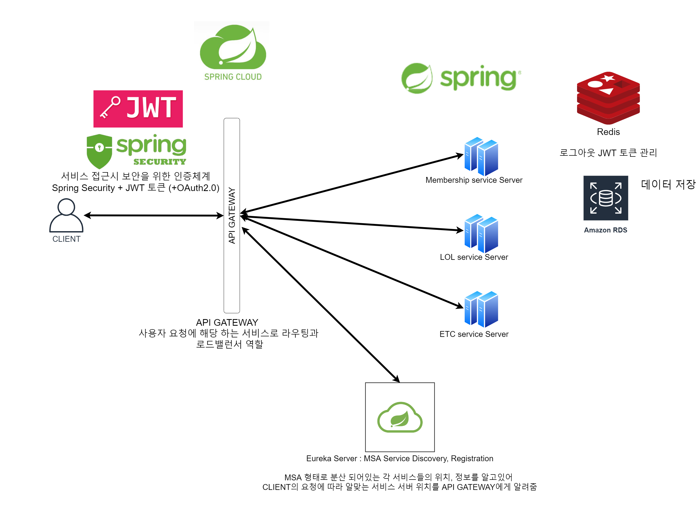

# membership-service

요구 사항

- [X]   이메일 회원가입
- [X]   로그인
- [X]   로그아웃
- [X]   소셜 서비스 연동
- [X]   서비스 Architecture 설계도 

### 보안을 위한 인증 체계
Spring Security + JWT 활용 (+ OAuth2.0)

일반 이메일 기반 회원 , 소셜 로그인을 통한 회원 

모두 로그인 시 발급 되는 token (JWT 토큰)으로 인증이 필요한 서비스들 호출

### DB

개발 환경
- H2 DB
- Redis

운영 환경 
- AWS-RDS (mySQL)
- Redis

### API

| Uri                                |accessToken (JWT 토큰) | Request Body                          |Http Method | description                |
| ------------------------------------ |--- |----------------------------- | ------ | -------------------------- |
| /api/members                       |x | username, password, name                               | POST    | 이메일 기반 회원가입      |
| /api/members/{memberId}            |필수 |                | GET   | 멤버 상세 조회      |
| /api/login                       |x | username, password                               | POST    | 이메일 기반 로그인      |
| /api/logout                       |필수 | token                               | POST    | 로그아웃      |

### OAuth2.0 Handler
| Uri                                | description                |
| ------------------------------------ | -------------------------- |
| /oauth/login/{provider}                    |각 소셜 로그인 시 처리해주는 핸들러 , 소셜 로그인을 통해 자동 회원가입 or 로그인이 된다. 성공시 token(JWT 토큰)을 발급 해줌 |

provider는 소셜 로그인 제공자들 
- kakao
- naver

ex) /oauth/login/kakao

### membership-service의 Swgger (API gateway를 통해서 연결)

http://ec2-54-180-154-7.ap-northeast-2.compute.amazonaws.com:8000/membership-service/swagger-ui.html#

### 서비스 Architecture

서비스의 보안을 위한 Spring Security + JWT (+ 소셜 서비스를 위한 OAuth2.0) 적용

MSA 기반 서비스를 위한 Spring Cloud 활용

## 각 구성요소 사용 이유와 역할

1.Spring Security
- 서비스의 보안을 위해 사용
- 인증 / 인가

2.JWT
- RESTAPI 형태에 알맞게 토큰 기반으로 인증 할 수 있도록 사용
- 모바일, 웹 다양한 환경에서 지원이 가능함
- 언어에도 제약을 받지 않음

3.Spring Cloud
- MSA 기반 서비스 구성에 알맞음
- Java Spring 뿐만 아니라 다른 언어의 서버와도 사용 가능

4.Spring Cloud Gateway
- Spring cloud 에서 지원하는 현 기준 가장 최신의 API GATEWAY
- MSA 로 분산 된 환경에서 사용자의 요청에 따라 알맞은 서비스로 라우팅(routing) 및 부하 분산(load balancing) 기능 
- Gateway 에 여러 임의의 필터들로 요청 전 후 처리 가능 (ex 로깅, 인증 등)

5.Eureka
- 각 분산 되어있는 서비스들의 정보(ip주소 포트번호 등)들을 관리해줌
- 각 서비스가 Eureka에 자신들을 등록하는 형식으로 각 분산 된 서비스들의 ip,port 등을 알고 있을 필요가 없음

6.Redis
- 로그아웃 시 JWT 토큰을 만료시키기 위해 사용
- 로그아웃 시 Redis에 등록되는 토큰은 만료시간이 지나면 사라짐 

7.AWS-RDS
- 데이터들을 저장

8.AWS-EC2
- 서버 운용

## MSA 구조의 장단점

장점 :
- 각 서비스 별 개별 배포 가능 (배포 시 전체 서비스의 중단이 없음)
- 각 서비스 별로 SCALE IN/OUT 용이
- 특정 서비스에 대한 확장성이 용이함
- 특정 서비스의 장애가 전체 서비스로 확장 될 가능성이 적음
- 각 서비스마다 알맞은 언어로 개발이 가능

단점 :
- 서비스 간 호출 시 API 통신을 해야하므로 그에 대한 비용 증가
- 전통적인 Monolithic Architecture에 비해 복잡하고 고려할 것이 많음

## Repositories

[멤버십 서비스 레포지토리](https://github.com/mks502/membership-service)

[API GATE WAY 서비스 레포지토리](https://github.com/mks502/apigateway-service)

[DISCOVERY 서비스 레포지토리](https://github.com/mks502/discoveryservice)